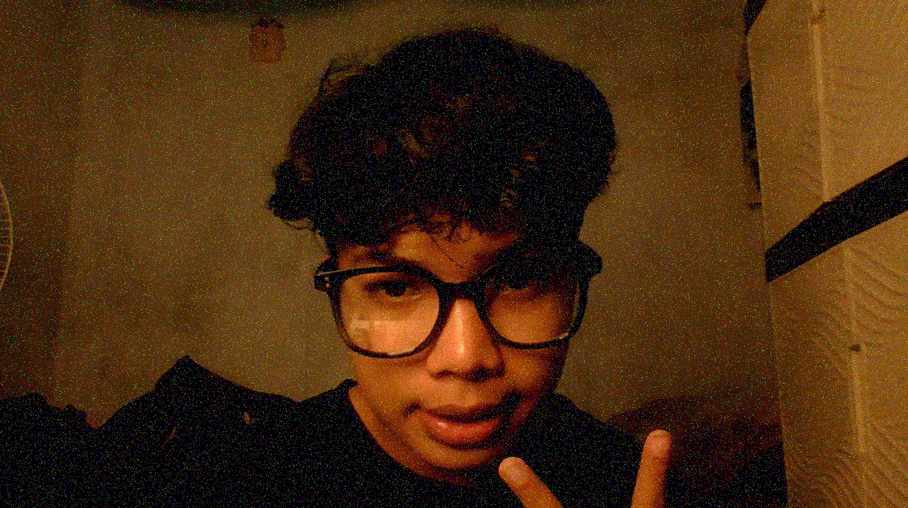
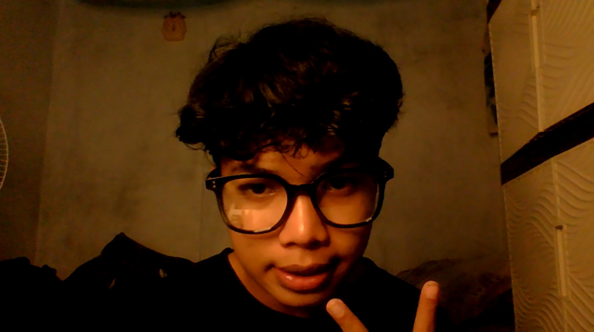

# Studi Perbaikan Kualitas Citra Digital
## Menggunakan Metode Spatial dan Frequency Domain

---

## 👤 Tentang Project
Project ini dibuat sebagai bagian dari tugas mata kuliah Pengolahan Citra Digital.  
Tujuan utama dari project ini adalah untuk memahami serta mengimplementasikan teknik perbaikan citra digital, khususnya dalam mengurangi noise dan meningkatkan kualitas visual gambar.

Selain sebagai tugas akademik, project ini juga menjadi bagian dari pengembangan portofolio pribadi di bidang teknologi.

---

## 🎯 Tujuan
- Memahami konsep dasar perbaikan citra digital  
- Mengidentifikasi jenis-jenis noise pada citra  
- Mengimplementasikan metode perbaikan citra  
- Membandingkan hasil sebelum dan sesudah proses  

---

## 🧠 Landasan Teori

### 1. Citra Digital
Citra digital adalah representasi visual dalam bentuk data numerik yang dapat diolah menggunakan komputer.

---

### 2. Noise pada Citra
Noise adalah gangguan yang muncul pada citra sehingga menurunkan kualitas gambar.  
Beberapa jenis noise yang digunakan dalam project ini:
- Gaussian Noise  
- Salt & Pepper Noise  
- Speckle Noise  

---

### 3. Metode Perbaikan Citra

#### 🔹 Spatial Domain
Metode ini bekerja langsung pada nilai piksel citra.

Contoh:
- Mean Filter  
- Median Filter  

Kelebihan:
- Mudah diimplementasikan  

Kekurangan:
- Dapat mengurangi detail gambar  

---

#### 🔹 Frequency Domain
Metode ini bekerja dengan mengubah citra ke domain frekuensi menggunakan Transformasi Fourier.

Contoh:
- Low-pass filter  
- High-pass filter  

Kelebihan:
- Lebih fleksibel dalam memisahkan noise  

Kekurangan:
- Lebih kompleks dibanding metode spasial  

---

## ⚙️ Implementasi

Tools yang digunakan:
- Python  
- OpenCV  
- NumPy  
- Matplotlib  
- scikit-image  

Langkah-langkah:
1. Membaca citra dari folder `assets`  
2. Menambahkan noise (salt & pepper)  
3. Menerapkan median filter (spatial domain)  
4. Menerapkan low-pass filter (frequency domain)  
5. Menyimpan dan menampilkan hasil  

---

## 🖼️ Hasil

Berikut perbandingan hasil pengolahan citra:

| Original | Noise |
|---------|-------|
|  |  |

| Spatial (Median) | Frequency (Low-pass) |
|------------------|----------------------|
|  |  |

---

## 📊 Analisis
- Noise berhasil ditambahkan menggunakan metode salt & pepper  
- Median filter cukup efektif dalam mengurangi noise tanpa merusak terlalu banyak detail  
- Low-pass filter pada domain frekuensi mampu menghaluskan citra, namun menghasilkan gambar yang lebih blur  
- Setiap metode memiliki kelebihan dan kekurangan tergantung kebutuhan  

---

## 🚀 Kesimpulan
Perbaikan citra digital merupakan proses penting dalam meningkatkan kualitas visual suatu gambar.

Dari project ini dapat disimpulkan bahwa:
- Tidak ada metode yang benar-benar sempurna  
- Pemilihan metode harus disesuaikan dengan jenis noise  
- Terdapat trade-off antara mengurangi noise dan mempertahankan detail  

---

## 💬 Refleksi Pribadi
Project ini bukan hanya tentang menyelesaikan tugas, tetapi juga tentang proses belajar dan pengembangan diri.

Melalui project ini, saya belajar bahwa pemahaman konsep dan praktik langsung sangat penting dalam bidang teknologi.

> “Bertarunglah sehancur-hancurnya selagi muda, sampai tak tersisa sedikitpun kerusakan di masa depanmu.”

---

## 📎 Penutup
Terima kasih telah melihat project ini.  
Semoga project ini dapat memberikan manfaat dan menjadi langkah awal dalam pengembangan kemampuan di bidang teknologi.